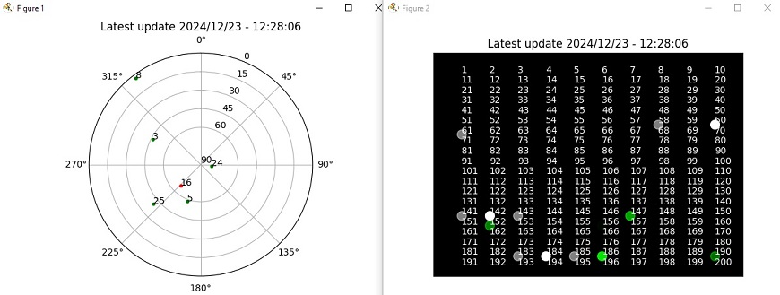

# Galileo Reference Tree


[](https://app.codacy.com/gh/aramvroom/galileo-reference-tree/dashboard?utm_source=gh&utm_medium=referral&utm_content=&utm_campaign=Badge_coverage)
[](https://app.codacy.com/gh/aramvroom/galileo-reference-tree/dashboard?utm_source=gh&utm_medium=referral&utm_content=&utm_campaign=Badge_grade)
[](https://github.com/aramvroom/galileo-reference-tree/actions/workflows/tests.yml)
[](https://github.com/aramvroom/galileo-reference-tree/actions/workflows/github-code-scanning/codeql)
[](https://opensource.org/licenses/MIT)

---

This repository contains a hobby project to show the live Galileo constellation visibility and status as LEDs in a
Christmas tree. The color and brightness of the LEDs correspond to the health status and elevation respectively. It is
inspired by a combination of Matt Parker's [Programmable Christmas Tree](https://www.youtube.com/watch?v=TvlpIojusBE)
and Bert Hubert's [Galmon](https://galmon.eu/).
The scripts automatically retrieve the latest orbits from Two Line Element (TLE) and ephemeris data, compute the
elevations at a preconfigured user location and control the LEDs through the GPIO pins accordingly.

Tested with Python 3.11 and 3.13 on Raspberry Pi OS (H/W: Pi 4B) and Windows (for dev. purposes)

## Table of Contents
  * [Features](#features)
  * [Installation](#installation)
    * [Raspberry Pi with LED Strip](#raspberry-pi-with-led-strip)
      * [Software Installation Steps](#software-installation-steps)
    * [Development Environment without LED Strip](#development-environment-without-led-strip)
  * [Hardware Setup](#hardware-setup)
  * [Configuration Options](#configuration-options)
    * [General Settings](#general-settings)
    * [NTRIP Settings](#ntrip-settings)
    * [LED Settings](#led-settings)
  * [3D Models](#3d-models)
  * [License](#license)
<!-- TOC -->

## Features

* Control of a LED strip through a Raspberry Pi's GPIO pins
* Autonomous retrieval of the latest ephemeris from NTRIP casters,
    * Compatible with many providers, including the
      Dutch [Kadaster NTRIP Caster](http://monitor.use-snip.com/?hostUrl=ntrip.kadaster.nl&port=2101)
      and [RTK2GO](http://monitor.use-snip.com/?hostUrl=rtk2go.com&port=2101),
* Capable of displaying satellites not transmitting ephemeris through autonomous retrieval of CelesTrak Two Line
  Element (TLE) data,
* Satellite elevation indication through configurable LED brightness levels,
* Satellite health status indication through configurable colors,
* Configurable simulation speed for faster than real-time simulation,
* Customizable to different setups (user location, number of LEDs, used GPIO pins, etc.) through a TOML config file,
* Compatible with many different LED strips, including WS2811, WS2812 and SK6812 strips (note: only WS2811 is fully
  tested),
* Plots a live Skyplot and a graphical representation of the LEDs using `matplotlib`,
* Currently programmed for Galileo, but theoretically usable for any constellation
* Supports development on Windows environments through the `rpi_ws281x_mock` library



## Installation

### Raspberry Pi with LED Strip

These installation steps assume you have a Raspberry Pi (4B) with Raspberry Pi OS, git and python installed, which is
reachable through SSH or VNC. If this is not the case, check the steps below.
It is recommended to also first follow the steps under the [Hardware Setup](#hardware-setup) section to connect the LED
strip to the Raspberry Pi.

Note that any values between square brackets [example] should be replaced by your values.
<details><summary>Raspberry Pi Installation Steps</summary>

1. Download the [Raspberry Pi Imager](https://www.raspberrypi.com/software/)
2. Install Raspberry Pi OS on an SD card using the following settings:
    - Raspberry Pi Device: [your Raspberry Pi version]
    - Operating System: Raspberry Pi OS (64-bit)
    - Storage: [your storage device]
    - Preconfigure the username, password and wireless lan
    - Go to the Services tab and enable SSH
3. Slot the SD card into the Pi, power it up and connect using ssh `ssh [username]@[ip_address]`
    - _Note: can check the IP through your router for example_
4. Optional: set up VNC:
    - Run `sudo raspi-config`
    - Go to Interface options, and enable VNC
5. Ensure git and python are installed: `sudo apt-get install git python`

Your Pi is now ready to continue to the following steps.
</details>

#### Software Installation Steps

1. Clone this repository: `git clone https://github.com/aramvroom/galileo-reference-tree.git`
1. If you use the PWM pin (18), blacklist the analog audio from it (as it may otherwise interfere with the LED signal)
    - Create a new file: `sudo nano /etc/modprobe.d/snd-blacklist.conf`
    - Add the following to it: `blacklist snd_bcm2835`
1. Set up the virtual Python environment:
    ```
    cd galileo-reference-tree
    python -m venv venv
    source venv/bin/active
    pip install -r requirements.txt
    ```
1. Check that the unit tests pass: `sudo venv/bin/python -m unittest`
1. Customize `config.toml` to your setup (see [Configuration Options](#configuration-options) for more detail)
    - _Note: it is recommend to turn off plotting when running the software as a service_
1. Create a service which starts on boot (optional, but highly recommended)
    - Run `sudo systemctl edit --force --full grt.service`
    - Paste the following (replacing values between square brackets):
   ```
    [Unit]
    Description=Galileo Reference Tree
    Wants=network-online.target
    After=network-online.target
    
    [Service]
    Type=simple
    User=root
    WorkingDirectory=[Path to Repository]
    ExecStart=[Path to Repository]/venv/bin/python main.py
    Restart=always
    
    [Install]
    WantedBy=multi-user.target    
    ```
    - Enable the service with: `sudo systemctl enable grt.service`

### Development Environment without LED Strip

1. Clone this repository: `git clone https://github.com/aramvroom/galileo-reference-tree.git`
1. Set up the virtual Python environment:
    ```
   cd galileo-reference-tree
   python -m venv venv       
   source venv/bin/active                  # venv\Scripts\activate on Windows
   pip install -r requirements-dev.txt     # Uses rpi_ws281x_mock instead of rpi_ws281x
    ```
1. Check that the unit tests pass: `venv/bin/python -m unittest` (Windows: `venv\Scripts\python.exe -m unittest`)

## Hardware Setup

The hardware uses the following parts:

- Logic Level
  Converter ([example](https://www.tinytronics.nl/en/communication-and-signals/level-converters/spi-i2c-uart-bi-directional-logic-level-converter-4-channel)),
- 470 Ohm Resistor,
- 12V 6A Power Supply (enough for 200 LEDs),
- Raspberry Pi (tested with 4B),
- 12V WS2811 LED
  Strip ([example](https://www.amazon.com/ALITOVE-Addressable-Programmable-Waterproof-ALT-Connector/dp/B0923SDR5T?th=1)),
- Some 22 AWG and 20 AWG wires,
- Optionally, a 5-way wire
  connector ([example](https://www.tinytronics.nl/en/cables-and-connectors/connectors/push-in-wire-connectors/wago-push-in-wire-connector-5-way)).
  Can be soldered instead.

As can be seen in the figure below, the following GPIO pin connections are used:

- Pin 1 (3V3) to LV on the logic level shifter in order to indicate the low voltage,
- Pin 4 (5V) to HV on the logic level shifter to indicate the high voltage,
- Pin 12 (GPIO 18, PWM0) to the LV0 channel on the logic level shifter to transmit the data coming from the Pi,
- Pin 39 (GND) to the 5-way connector to ground the Pi.

From the logic level converter, the following connections are then made:

- The GND on the HV side of the converter is also connected to the 5-way connector for grounding,
- The HV0 channel is connected to a 470 Ohm resistor.

Lastly, the LED strip is connected as follows:

- The +12V side is connected to the 12V 6A power supply,
    - _Note: check the LED connections to ensure which cable is positive or negative,_
- The GND is connected to the 5-way connector, which is in turn connected to the power supply,
- The Data input is connected to the 470 Ohm resistor coming from the converter.

The usage of 20 AWG wire for the power supply to LED strip connection is highly recommended to minimize the chance of
overheating.


## Configuration Options

The configuration is handled through the `config.toml` file. The settings are elaborated upon in more detail below.

### General Settings

- `simulation-speed` - Float which allows for faster than real-time simulation. Defaults to 1 (real-time)
- `plotting` - Boolean indicating if the skyplot and LED visualization should be plotted
- `location` - The latitude, longitude and altitude in degrees and meters to compute the visibilities / elevations for

### NTRIP Settings

- Request header options:
    - `software-version` - Version of this software to identify with
    - `software-name` - Name of this software to identify with
    - `address` - URL of the NTRIP caster
    - `port` - Port of the NTRIP caster
    - `mountpount` - The caster mount point to use (you can use [this tool](http://monitor.use-snip.com) to find the
      closest one which provides RTCM 1046 messages)
    - `ntrip-v2` - Boolean indicating if NTRIP V2 should be used (otherwise uses V3)
    - `include-host-header` - Boolean indicating if the host header should be included (required by some casters)
    - `username-password` - The username and password to connect with (required by some casters)

An example configuration for connecting to the
Dutch [Kadaster NTRIP Caster](http://monitor.use-snip.com/?hostUrl=ntrip.kadaster.nl&port=2101) can be found below:

```
address = "ntrip.kadaster.nl"
port = 2101                  
mountpoint = "BCEP00KAD0"    
ntrip-v2 = false             
include-host-header = false  
username-password = "anonymous:none"  
```

An example configuration for [RTK2GO](http://monitor.use-snip.com/?hostUrl=rtk2go.com&port=2101) is also provided below:

```
address = "rtk2go.com"               
port = 2101                          
mountpoint = "AgPartner_1"           
ntrip-v2 = false                     
include-host-header = false          
username-password = "example@email.com:none"    # Note: must be a valid email address
```

### LED Settings
**General LED Settings**
- `led-count` - The number of LEDs
- `gpio-pin` - GPIO pin connected to the pixels (18 uses PWM, 10 uses SPI /dev/spidev0.0).
- `led-freq-hz` - LED signal frequency in hertz (usually 800kHz)
- `dma-channel` - DMA channel to use for generating the signal. Try 10, but be sure to read [this warning](https://github.com/jgarff/rpi_ws281x?tab=readme-ov-file#important-warning-about-dma-channels)
- `led-max-brightness` - The max brightness for the LEDs
- `invert-signal` - True to invert the signal (when using a negative-positive-negative transistor level shifter)
- `channel` - Channel to use. set to '1' for GPIOs 13, 19, 41, 45 or 53
- `led-strip-type` - The type of LED strip, see [this](https://github.com/aramvroom/galileo-reference-tree/blob/main/galileo_reference_tree/ledcontroller.py#L31) for a list of options
- `update-interval` - Update interval of the LEDs in seconds
- `plane-interval` - Interval for the LEDs showing the orbital planes

**Satellite LED Settings**
- `color-healthy` - [R,G,B] color to use for healthy satellites
- `color-unhealthy`- [R,G,B] color to use for unhealthy satellites
- `color-unknown` - [R,G,B] color to use for satellites with unknown health status
- `color-plane` - [R,G,B] color to use to display the orbital plane
- `brightness-early-late-plane` - Brightness for the early and late LEDs in the orbital plane animation
- `min-elev` - Minimum elevation to display
- `min-elev-brightness` - Brightness corresponding to the minimum elevation
- `max-elev` - Maximum elevation to display
- `max-elev-brightness` - Brightness corresponding to the maximum elevation
- `orbit-plane-a` - LED indicates corresponding to orbital plane A 
- `orbit-plane-b` - LED indicates corresponding to orbital plane B
- `orbit-plane-c` - LED indicates corresponding to orbital plane C
- `map-prns` - List of Satellite IDs
- `map-leds` - List of LED indices corresponding to the satellite IDs


## 3D Models
The `3d_models` directory contains 3 models: the satellite body, the satellite body with a hole for the LED and the solar panel. They are .f3d files which can be imported into Fusion360. 

In terms of printing, standard 0.20mm FDM printing gave good results. Simple superglue worked well for assembly.


## License

This repository and all its contents, including the 3D models and code, are provided under a permissive MIT license. As
such, this is an open source project that you are able to use however you wish, as long as you include the original
license and copyright. For more information, see the [LICENSE](LICENSE) file.
